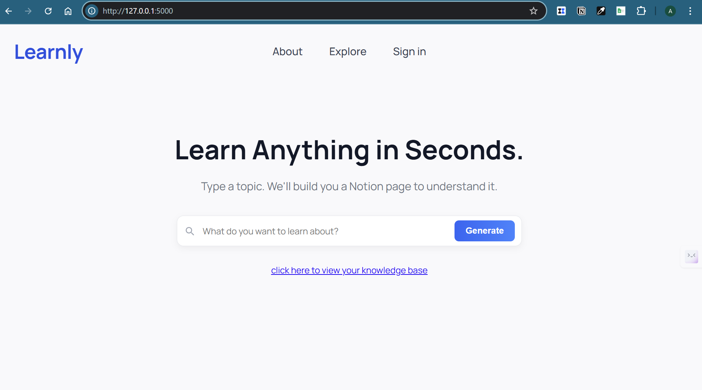
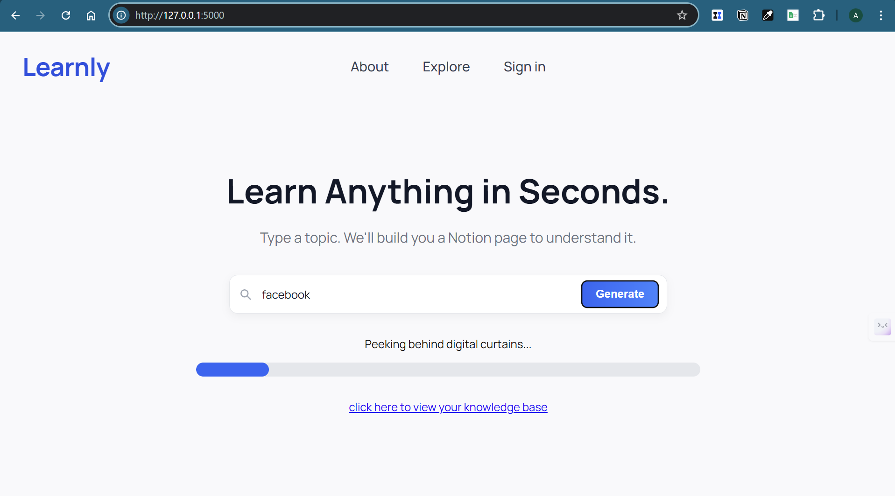
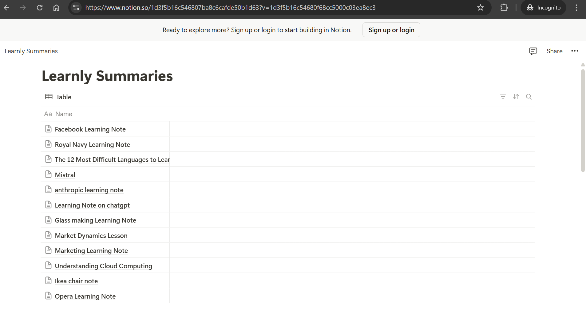

# Learnly - PortiaAI Learning Summarisation Tool

## Introduction

This project was developed for the Encode AI London 2025 hackathon. We aimed for the bounty offered by Portia AI and utilised their SDK. Showcases both Notion and Youtube API interactions.

This project uses **Portia AI** to supercharge your learning. The user can enter a topic on their Learnly dashboard - and in the background **PortiaAI** plans and executes an agentic workflow that results in a topic summary page populated in the user's notion database.

 It utilizes the [Portia SDK](https://docs.portialabs.ai/) to integrate various tools, including custom-built tools for finding YouTube videos and adding content to Notion pages. The application leverages the [Youtube Data API v3](https://developers.google.com/youtube/v3) to search for a relevant youtube video, [YouTube Transcript API](https://github.com/jdepoix/youtube-transcript-api) to fetch video transcripts and the [Notion API](https://developers.notion.com/) to create and manage pages.

## Prerequisites

Before running this application, you'll need the following:

- **Python 3.8 or higher**: You can download it from [python.org](https://www.python.org/downloads/) or install it using [pyenv](https://github.com/pyenv/pyenv).
- **Flask**: A lightweight WSGI web application framework for Python. Install it via pip:
  ```bash
  pip install Flask
  ```
- **Portia SDK**: Install the Portia SDK using pip:
  ```bash
  pip install portia-sdk-python
  ```
- **YouTube API Key**: You can obtain one from the [Google Cloud Console](https://console.cloud.google.com/).
- **Notion API Key and Parent ID**: You can get these from your Notion integration settings. Follow the steps [here](https://developers.notion.com/docs/getting-started) to create an integration and retrieve the keys. It's important that you add a new database, and add a Connection to your Notion developer integration.
- **A `.env.local` file**: This file should contain your API keys in the following format:
  ```plaintext
  OPENAI_API_KEY=your_openai_api_key
  GOOGLE_API_KEY=your_google_api_key
  NOTION_API_KEY=your_notion_api_key
  NOTION_PARENT_ID=your_notion_parent_id
  PORTIA_API_KEY=your_portia_api_key
  TAGIVLY_API_KEY=your_tagivly_api_key
  ```

## Setup

1. Clone the repository:
   ```bash
   git clone https://github.com/annavanwingerden/Encode_Hacakthon_PortiaAI.git
   cd your-repo
   ```
2. Install the required packages:
   ```bash
   pip install -r requirements.txt
   ```
3. Create a `.env.local` file in the root directory and add your API keys as described above.

## Running the Application

To run the application, use the following command:
```bash
python main.py
```
The application will start on `http://127.0.0.1:5000/`.

## Testing

If you want to test this, you can send a POST request to the `/run` endpoint with a JSON body containing the topic you want to generate notes for:
```json
{
    "topic": "Your Topic Here"
}
```
## Usage

To run the app, run `python main.py` in your terminal.
If you have different versions of python installed on your device - `python3 main.py` may be more appropiate.

## Understanding the Code

### Main Application

`main.py` is the entry point for the application. It initializes the Flask app, loads environment variables, and sets up the Portia instance with the custom tool registry. The `/run` endpoint processes user queries and generates notes using the Portia AI framework.

### Custom Tools

- **Find Video Tool**: Located in `my_custom_tools/find_video_tool.py`, this tool searches for YouTube videos based on a given topic and retrieves the transcript of the first result.
- **Notion Page Add Tool**: Found in `my_custom_tools/notion_pageadd_tool.py`, this tool creates a new Notion page and writes the first paragraph of content using a Node.js script located in `my_custom_tools/notion_integration.js`.

### Notion Integration

The `notion_integration.js` script handles the API requests to Notion, creating pages with the specified content. Ensure that the script is correctly referenced in the Notion Page Add Tool to avoid errors.

## Troubleshooting

If you encounter issues with the Notion integration, ensure that the `notion_integration.js` file is present in the `my_custom_tools` directory and that your API keys are correctly set in the `.env.local` file.

## Contributing

Contributions are welcome! Please open an issue or submit a pull request.

## License

This project is licensed under the MIT License - see the [LICENSE](LICENSE) file for details.

## Examples


The homepage. Enables the user to enter a topic of their choosing.

While the agent is executing, the user can see a progress bar, to ensure them the backend is not idling.

After the process has concluded, a corresponding page is created on the user's chosen notion page